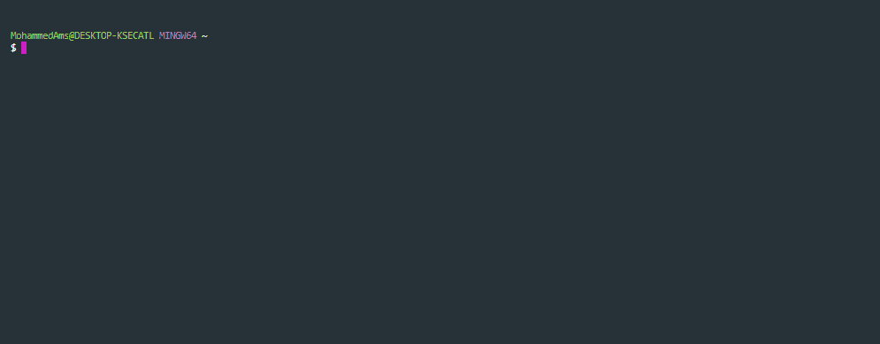

# Joke API Command-Line Tool

The [Joke API](https://sv443.net/jokeapi/v2/) Command-Line Tool is a Node.js application that allows users 
to interact with the Joke API and retrieve jokes based on user-selected categories and types.
> Note: Jokes CLI relies on the Joke API to retrieve jokes. Ensure that your device has a stable internet connection for accessing the API.

## Key Features
- Simple and intuitive command-line interface provided using inquirer.
- Provides a range of categories and types to choose from, enabling users to customize their joke preferences.
- Presents jokes in a readable format, making them easy to enjoy.

## Overview

## Demo
> This gif shows a brief overview of the project, and it may take a while to load!

## Usage
To run this application locally, follow these steps:
- Clone the repository: git clone https://github.com/mohammedamcs/jokes-cli.git
- Navigate to the project directory: cd jokes-cli
- Install the dependencies: npm install
- Run 'node index.js' to start or
- Execute 'npm link' to create a global symlink for the tool and then run jokes-cli.
> Make sure you have Node.js and npm (Node Package Manager) installed on your machine before running these commands.

